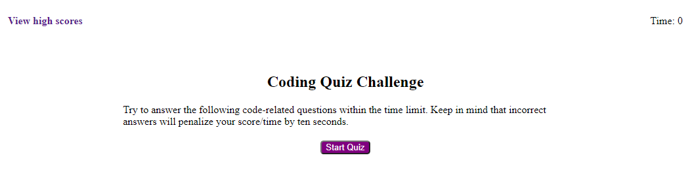

  
# Coding Quiz

## Description

This repository contains the code base used in creating the **Coding Quiz** application. The original code contains 4 code related questions to be answered by the user. These questions can be updated as needed to introduce a more robust quiz experience. 

## App

The code quiz app can be found [here](https://nnavarr.github.io/code-quiz/).

## Usage
To begin the quiz, simply click the 'Start Quiz' button. From there, 75 seconds will be added to the timer and the quiz object will populate the question/answers randomly. Be careful, any incorrect responses will reduce the timer by 10 seconds! 

Once the quiz is complete, the user can log their initials into the local storage. This way, when the user returns, they can see the most recent 10 scores. Lastly, when the user would like a new set, they can clear the local storage and begin once more. 
